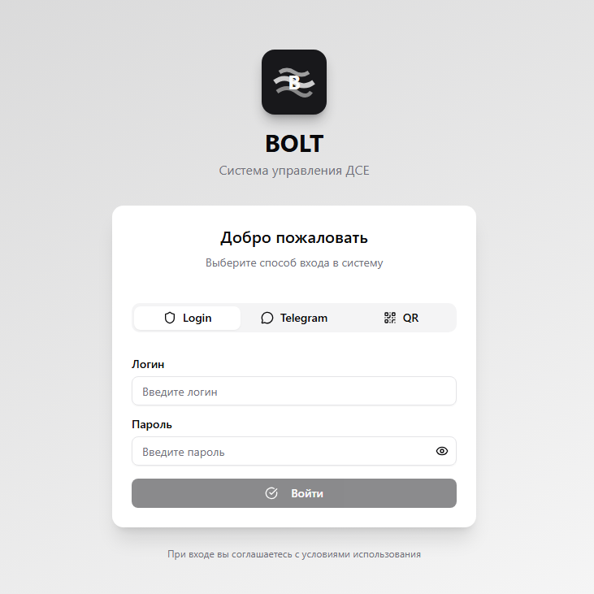

#  BOLT

[](https://github.com/yourusername/bolt)
[](https://docker.com)
[](LICENSE)

> Современная система управления деталями и заявками (ДСЕ) с веб-интерфейсом, чатом и аналитикой.



## Возможности

- **Дашборд с аналитикой** - графики, статистика, KPI
- **Управление заявками** - создание, редактирование, фильтрация
- **Встроенный чат** - WebSocket, real-time сообщения
- **Управление пользователями** - роли, права доступа
- **Множественная авторизация** - Login/Password, Telegram, QR-код
- **Адаптивный дизайн** - работает на всех устройствах
- **Тёмная тема** - переключатель тем
- **Экспорт данных** - Excel, PDF, CSV
- **Поиск и фильтрация** - мощные инструменты поиска

## Архитектура

```
┌─────────────────┐     ┌─────────────────┐     ┌─────────────────┐
│   Frontend      │     │    Backend      │     │   PostgreSQL    │
│   (React)       │     │   (Node.js)     │     │   (Docker)      │
└─────────────────┘     └─────────────────┘     └─────────────────┘
     Port: 5173              Port: 3001             Port: 5432
```

## Быстрая установка

### Автоматическая установка (рекомендуется)

1. Склонируйте репозиторий
```bash
git clone https://github.com/Nickto55/TelegrammBolt.git
cd TelegrammBolt/web/
```
2. Запустите установочный скрипт
```bash
chmod +x install.sh
./install.sh
```

Скрипт автоматически:
- Проверит и установит зависимости (Docker, Docker Compose)
- Настроит домен и SSL-сертификаты (Let's Encrypt)
- Позволит выбрать порт для подключения к БД
- Сгенерирует все конфигурационные файлы
- Запустит все сервисы
- Проверит работоспособность

### Ручная установка через Docker

```bash
# 1. Клонирование
git clone https://github.com/yourusername/bolt.git
cd bolt

# 2. Настройка окружения
cp .env.example .env
# Отредактируйте .env

# 3. Запуск
docker-compose up -d

# 4. Проверка
curl http://localhost:3001/health
```

## Требования

### Минимальные
- **CPU**: 1 ядро
- **RAM**: 1 GB
- **Disk**: 5 GB
- **OS**: Linux (Ubuntu 20.04+, CentOS 8+, Debian 10+)

### Рекомендуемые
- **CPU**: 2+ ядра
- **RAM**: 2+ GB
- **Disk**: 10+ GB SSD
- **OS**: Ubuntu 22.04 LTS

### Зависимости
- Docker 20.10+
- Docker Compose 2.0+
- Git
- curl
- OpenSSL

## Управление системой

Используйте скрипт `bolt.sh` для управления:

```bash
# Основные команды
./bolt.sh start          # Запустить все сервисы
./bolt.sh stop           # Остановить все сервисы
./bolt.sh restart        # Перезапустить
./bolt.sh status         # Проверить статус

# Логи
./bolt.sh logs           # Все логи
./bolt.sh logs backend   # Логи бэкенда
./bolt.sh logs postgres  # Логи базы данных

# Обновление
./bolt.sh update         # Обновить до последней версии

# Резервное копирование
./bolt.sh backup         # Создать бэкап
./bolt.sh restore        # Восстановить из бэкапа

# База данных
./bolt.sh db backup      # Бэкап БД
./bolt.sh db restore     # Восстановление БД
./bolt.sh db console     # Консоль PostgreSQL

# SSL сертификаты
./bolt.sh cert renew     # Обновить сертификат
./bolt.sh cert status    # Проверить статус

# Другое
./bolt.sh shell backend  # Открыть shell в контейнере
./bolt.sh clean          # Очистить Docker
./bolt.sh help           # Показать справку
```

## Данные для входа

После установки используйте:

- **URL**: http://localhost:5173 (или ваш домен)
- **Логин**: `admin`
- **Пароль**: `admin123`

 **Важно**: Смените пароль после первого входа!

## Настройка домена и SSL

### При установке

Установочный скрипт спросит:
```
Do you want to configure a custom domain? (y/N): y
Enter your domain (e.g., bolt.example.com): bolt.yourdomain.com
Do you want to enable SSL with Let's Encrypt? (y/N): y
Enter email for Let's Encrypt notifications: admin@yourdomain.com
```

### Вручную

```bash
# Получить сертификат
sudo certbot certonly --standalone -d bolt.yourdomain.com

# Скопировать
sudo cp /etc/letsencrypt/live/bolt.yourdomain.com/fullchain.pem ./nginx/ssl/
sudo cp /etc/letsencrypt/live/bolt.yourdomain.com/privkey.pem ./nginx/ssl/

# Перезапустить
docker-compose restart nginx
```

## Подключение к внешней базе данных

### При установке

```
Do you have an external PostgreSQL database? (y/N): y
Enter database host (IP or hostname): db.example.com
Enter database port [5432]: 5432
Enter database name [bolt_db]: bolt_db
Enter database user [bolt_user]: bolt_user
Enter database password: ********
```

### Требования к БД

```sql
-- Создать базу данных
CREATE DATABASE bolt_db;

-- Создать пользователя
CREATE USER bolt_user WITH PASSWORD 'your_secure_password';

-- Дать права
GRANT ALL PRIVILEGES ON DATABASE bolt_db TO bolt_user;

-- Разрешить удалённые подключения (postgresql.conf)
listen_addresses = '*'

-- Настроить доступ (pg_hba.conf)
host bolt_db bolt_user 0.0.0.0/0 md5
```

## API Endpoints

### Аутентификация

| Method | Endpoint | Описание |
|--------|----------|----------|
| POST | `/api/auth/login` | Вход по логину/паролю |
| POST | `/api/auth/telegram` | Вход через Telegram |
| POST | `/api/auth/qr` | Вход по QR-коду |
| GET | `/api/auth/me` | Информация о пользователе |

### DSE (Заявки)

| Method | Endpoint | Описание |
|--------|----------|----------|
| GET | `/api/dse` | Список заявок |
| POST | `/api/dse` | Создать заявку |
| GET | `/api/dse/:id` | Получить заявку |
| PUT | `/api/dse/:id` | Обновить заявку |
| DELETE | `/api/dse/:id` | Скрыть заявку |
| GET | `/api/dse/stats` | Статистика |

Полная документация API: [API.md](docs/API.md)

## WebSocket Events

### Подключение
```javascript
const socket = io('ws://localhost:3001', {
  auth: { token: 'your-jwt-token' }
});
```

### События

**Клиент → Сервер:**
- `join-room` - Присоединиться к комнате
- `send-message` - Отправить сообщение
- `typing` - Индикатор набора

**Сервер → Клиент:**
- `new-message` - Новое сообщение
- `user-typing` - Пользователь печатает

## Структура проекта

```
bolt/
├── app/                    # React Frontend
│   ├── src/
│   │   ├── components/     # UI компоненты
│   │   ├── pages/          # Страницы
│   │   ├── hooks/          # React hooks
│   │   ├── services/       # API сервисы
│   │   └── types/          # TypeScript типы
│   └── dist/               # Production сборка
├── bolt-backend/           # Node.js Backend
│   ├── src/
│   │   ├── controllers/    # API контроллеры
│   │   ├── models/         # Модели БД (Sequelize)
│   │   ├── routes/         # Маршруты
│   │   └── middleware/     # Middleware
│   └── Dockerfile
├── nginx/                  # Nginx конфигурация
├── docker-compose.yml      # Docker Compose
├── install.sh              # Установочный скрипт
├── bolt.sh                 # Скрипт управления
├── .env                    # Переменные окружения
└── DEPLOY.md               # Детальная инструкция
```

## Разработка

### Frontend

```bash
cd app
npm install
npm run dev
```

### Backend

```bash
cd bolt-backend
npm install
npm run dev
```

### База данных

```bash
# Миграции
docker-compose exec backend npm run db:migrate

# Сидеры (тестовые данные)
docker-compose exec backend npm run db:seed
```

## Тестирование

```bash
# Backend tests
cd bolt-backend
npm test

# Frontend tests
cd app
npm test
```

## Резервное копирование

### Автоматическое

Автоматические бэкапы настраиваются при установке (ежедневно в 2:00 AM).

### Ручное

```bash
# Создать бэкап
./bolt.sh backup

# Восстановить
./bolt.sh restore backups/db_20240101_120000.sql.gz
```

### Что бэкапится

- База данных PostgreSQL
- Загруженные файлы (uploads/)
- Конфигурация (.env, docker-compose.yml, nginx/)

## Устранение неполадок

### Сервисы не запускаются

```bash
# Проверить логи
./bolt.sh logs

# Проверить статус Docker
docker ps -a

# Перезапустить
./bolt.sh restart
```

### Ошибки базы данных

```bash
# Проверить подключение
docker-compose exec postgres pg_isready -U bolt_user

# Восстановить из бэкапа
./bolt.sh db restore backups/db_xxx.sql.gz
```

### Проблемы с SSL

```bash
# Проверить сертификат
./bolt.sh cert status

# Обновить вручную
sudo certbot renew --force-renewal
./bolt.sh restart
```

### Сбросить всё (ОПАСНО!)

```bash
./bolt.sh reset
```

## Мониторинг

### Health Check

```bash
curl http://localhost:3001/health
```

### Метрики

```bash
# Docker stats
docker stats

# Логи в реальном времени
./bolt.sh logs -f
```
